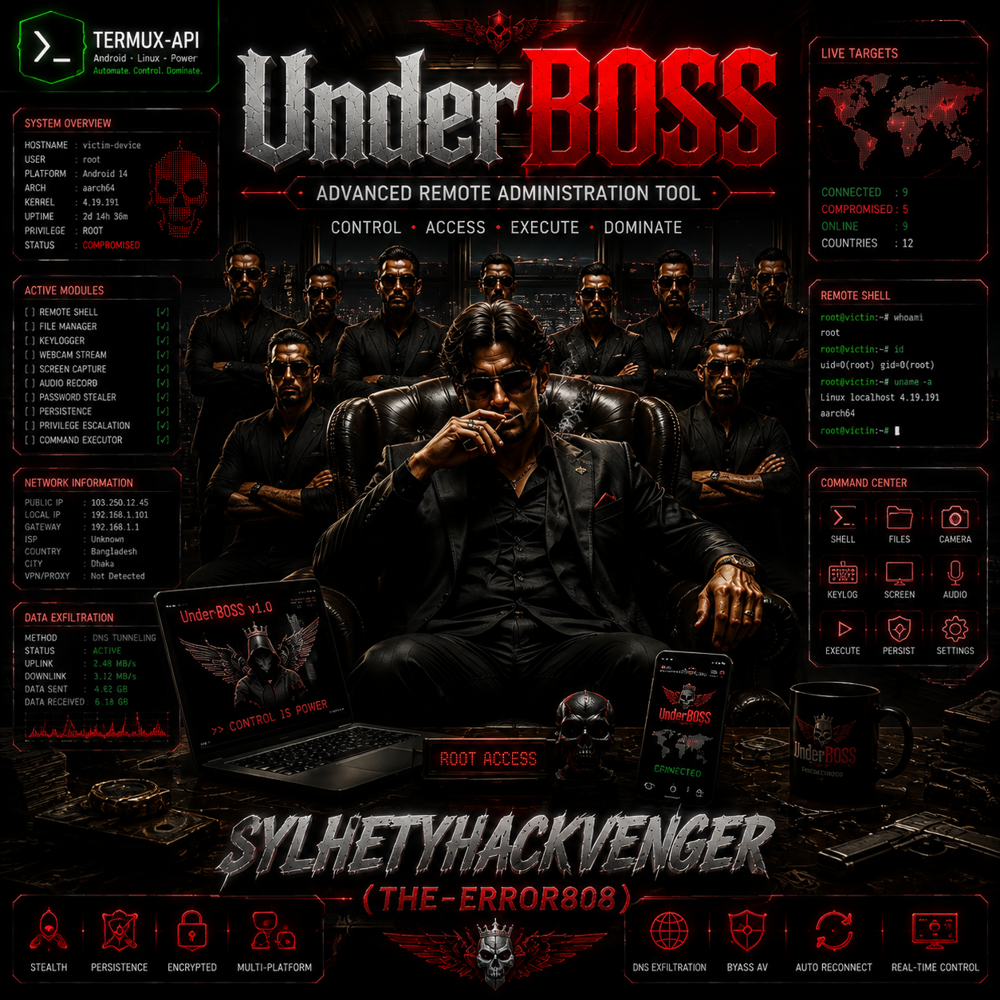
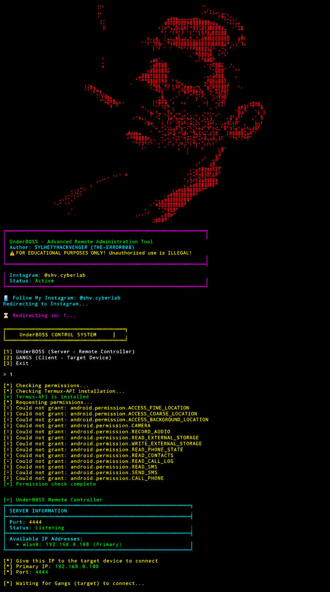

# UnderBOSS - Advanced Remote Administration Tool
<p align="center">
  
</p>

---

📋 Overview

UnderBOSS is a sophisticated, feature-rich remote administration and penetration testing tool designed for Android devices. Developed by SYLHETYHACKVENGER (THE-ERROR808), this powerful framework provides comprehensive remote access capabilities, system monitoring, device control, and advanced surveillance features through a client-server architecture.

This tool is built for cybersecurity professionals, penetration testers, and security researchers to demonstrate the potential security risks in mobile devices and to test defensive mechanisms. The application implements a robust command-and-control (C2) infrastructure with over 80 distinct commands, enabling full device manipulation including hardware control, data extraction, and system interaction.

The tool operates in two primary modes: BOSS (server/controller) and GANGS (client/target), establishing encrypted communication channels through socket-based networking. With its extensive feature set ranging from basic device information gathering to advanced multimedia control and surveillance capabilities, UnderBOSS represents a comprehensive mobile security assessment platform.

⚠️ IMPORTANT DISCLAIMER: This tool is intended SOLELY for educational purposes, authorized security testing, and research. Unauthorized access to devices, data theft, or any malicious use is strictly prohibited and violates computer crime laws worldwide. Users are responsible for obtaining proper authorization before using this tool on any system. The developer assumes no liability for misuse or illegal activities conducted with this software.

---

🚀 Core Capabilities

📱 Device Intelligence & System Monitoring

· Comprehensive Device Profiling: Brand, Model, Android Version, Architecture
· Real-time System Metrics: RAM usage, Storage analysis, CPU information
· Network Information: IP addresses, Connection types, SIM operator details
· Process Management: List and terminate running processes
· Battery Analytics: Detailed battery status and consumption data
· Device Logs: Access to system logs and event monitoring

💡 Hardware Control & Manipulation

· Flashlight Control: ON/OFF, Toggle, Flicker patterns (SOS, Disco, Speed variations)
· Screen Manipulation: Flicker effects, Disco mode, Power cycling
· Volume Management:
  · Precise percentage control (0-100%)
  · Smooth transitions (Fade in/out)
  · Stream-specific adjustment (Music, Ring, Alarm, Notification)
  · Jump increments
· Vibration Control: Customizable duration and patterns
· Device Locking: Remote screen lock capability

📡 Surveillance & Data Extraction

· Camera Access: Capture photos remotely
· Audio Recording: Scheduled recordings with duration control
· Location Tracking:
  · GPS/Network positioning
  · Continuous tracking with map links
  · Location history logging
· Contacts Extraction: Access to device contact list
· SMS Retrieval: Read inbox messages
· Call Logs: Historical call records
· Keylogger: Keystroke monitoring (root required)
· WiFi Password Extraction: Network credentials (root required)

🔍 Search & Multimedia Control

· Search Engine Integration:
  · Google Web Search
  · YouTube Search & Trending
  · Google Images
  · Google News
· YouTube Playback: Remote video playback control
· Screenshot Capture:
  · Timestamped captures
  · Multiple screenshot loops
  · Screenshot with metadata
· Screen Recording: Scheduled screen capture sessions
· Search History: Browser and app search history retrieval

📨 Communication & Notifications

· Voice Alerts: Text-to-Speech announcements
· Popup Notifications: Customizable alerts with titles
· SMS Sending: Remote message dispatch
· Phone Calls: Initiate calls programmatically
· Emergency Modes: Various ringing patterns (SOS, Emergency, Custom)
· Notification Management: System notification control

🛡️ Persistence & Security

· Auto-Start Configuration: Boot-time execution setup
· Persistent Connections: Scheduled reconnection attempts
· Self-Destruct Mechanism: Remote self-removal capability
· Log Clearing: System and application log removal
· Process Management: Process termination capabilities
· Hidden Operation: Stealth configuration options

📊 Advanced Features

· Volume Control Suite: 20+ volume manipulation commands
· Ringing Patterns: Multiple alert patterns (Pattern, SOS, Emergency, Custom)
· Flashlight Effects: Disco, SOS, Speed variations
· Screen Effects: Flicker, Disco, SOS patterns
· Combined Effects: Simultaneous screen + flashlight manipulation
· File System Access: Remote file download capability
· Custom Command Execution: Shell command injection

---

🔧 How It Works

Architecture Overview

The UnderBOSS system implements a classic Client-Server (C2) architecture with sophisticated networking capabilities. The communication flow operates as follows:

1. Connection Establishment
   · The BOSS (Server) initializes on port 4444 and begins listening for incoming connections
   · Multiple IP addresses are displayed for connection flexibility
   · The GANGS (Client) establishes a persistent TCP connection to the server IP
   · Connection handling includes timeout management and automatic reconnection
2. Command Protocol
   · Commands are transmitted as string-encoded messages
   · Each command triggers specific routines on the target device
   · Results are returned as text or binary data
   · Error handling ensures graceful failure management
3. Execution Flow
   · BOSS sends encoded commands to the connected client
   · GANGS receives, parses, and executes the command
   · Output is captured and returned to the BOSS
   · Real-time feedback displays in the controller interface

Technical Implementation

```
BOSS (Controller) ⟷ Socket Connection (Port 4444) ⟷ GANGS (Target)
```

Key Technical Components:

· Socket Communication: TCP/IP networking with configurable timeouts
· Command Processing: String-based command parsing and execution
· Subprocess Integration: Shell command execution for system-level operations
· Permission Management: Android permission handling through Termux-API
· Error Recovery: Timeout handling and automatic reconnection
· Multi-threading: Background processes for continuous operations

Security Features

· Permission Request System: Automatic permission acquisition for all features
· Stealth Operation: Minimal system footprint during execution
· Encrypted Communication: Socket-level security (consider implementing TLS)
· Remote Control: Complete device manipulation from anywhere
· Self-Protection: Auto-start and persistence mechanisms

Implementation Details

The tool leverages Termux-API for Android hardware access, enabling:

· Camera control through termux-camera-photo
· Audio recording via termux-microphone-record
· Location services with termux-location
· Flashlight control using termux-torch
· Notification management with termux-notification
· SMS and calling through termux-sms-send and termux-telephony-call

System-level commands utilize Android's native utilities:

· screencap for screenshots
· screenrecord for video capture
· input for UI simulation
· am for application management
· pm for package management
· content for database access

<div align="center">


</div>

---

📥 Installation Guide

Prerequisites

· Android Device with Termux installed
· Python 3.x environment
· Termux-API package
· Network connectivity (local network or internet)
· Storage permissions for file operations
<p align="center">
  
</p>

Quick Installation

```bash
# 1. Update package lists
pkg update && pkg upgrade -y

# 2. Install required packages
pkg install python3 python-pip net-tools tsu termux-api -y

# 3. Clone the repository
git clone https://github.com/sylhetyhackvenger/UnderBOSS 
cd UnderBOSS 

# 4. Install Python dependencies
pip install netifaces

# 5. Grant necessary permissions
termux-setup-storage
termux-permission

# 6. Run the tool
python3 underboss.py
```

Manual Setup

```bash
# Install dependencies manually
pkg install python3
pkg install termux-api
pip install netifaces

# Configure storage access
termux-setup-storage

# Grant permissions
for perm in ACCESS_FINE_LOCATION ACCESS_COARSE_LOCATION CAMERA RECORD_AUDIO READ_EXTERNAL_STORAGE WRITE_EXTERNAL_STORAGE READ_PHONE_STATE READ_CONTACTS READ_SMS SEND_SMS CALL_PHONE; do
    termux-permission grant android.permission.$perm
done
```

---

🎯 Usage Examples

Starting as BOSS (Controller)

```bash
python3 underboss.py
# Select option 1
# Server will display connection IPs
# Wait for GANGS connection
```

Starting as GANGS (Target)

```bash
python3 underboss.py
# Select option 2
# Enter BOSS IP address
# Connection establishes automatically
```

Common Operations

```bash
# Get device information
BOSS> 1

# Send voice alert
BOSS> 2
[?] Message to speak on target: This device is compromised

# Capture screenshot
BOSS> 49

# Get GPS location with map
BOSS> 39

# Flashlight effects
BOSS> 15  # Disco effect
BOSS> 16  # SOS signal

# Volume control
BOSS> 66  # Max volume
BOSS> 68  # Mute
BOSS> 70  # Smooth increase
BOSS> 72  # Jump increase

# Surveillance
BOSS> 33  # Get contacts
BOSS> 34  # Get SMS
BOSS> 35  # Get call logs
BOSS> 36  # Take photo
BOSS> 37  # Record audio (specify duration)
```

Advanced Operations

```bash
# Continuous location tracking
BOSS> 42
# Press Ctrl+C to stop

# Screen recording
BOSS> 53
[?] Screen record duration (seconds): 30

# Self-destruct
BOSS> 61
[!] Are you sure? Type 'yes' to confirm: yes

# Keylogger
BOSS> 31  # Start
BOSS> 32  # Stop & retrieve logs

# Multiple screenshots
BOSS> 51
[?] Number of screenshots: 10
```

---
🚀 One-Line Installation Script

```bash
pkg update && pkg upgrade -y && pkg install python3 python-pip net-tools termux-api tsu -y && pip install netifaces && termux-setup-storage
```
🛠️ Command Reference

System Information (1-10)

· 1: Device Intel
· 2: Voice Alert
· 3: Download File
· 4: Push Popup
· 5: List Apps
· 6: Battery & Storage
· 7: Device Logs
· 8: Custom Command
· 9: Flashlight ON
· 10: Flashlight OFF

Flashlight Effects (11-22)

· 11: Flashlight Toggle
· 12: Flicker (10x)
· 13: Fast Flicker (0.05s)
· 14: Slow Flicker (0.5s)
· 15: Disco Effect
· 16: SOS Signal
· 17: Screen Flicker
· 18: Screen Fast Flicker
· 19: Screen Slow Flicker
· 20: Screen Disco
· 21: Screen SOS
· 22: Combo Flicker

Search & Media (23-30)

· 23: Google Search
· 24: YouTube Search
· 25: YouTube Trending
· 26: Google Images
· 27: Google News
· 28: Both Google & YouTube
· 29: Search History
· 30: Play YouTube Video

Surveillance (31-42)

· 31: Keylogger Start
· 32: Keylogger Stop
· 33: Get Contacts
· 34: Get SMS
· 35: Get Call Logs
· 36: Take Photo
· 37: Record Audio
· 38: Get Location
· 39: Location with Map
· 40: Detailed Location
· 41: Save Location
· 42: Continuous Tracking

System Control (43-61)

· 43: WiFi Passwords
· 44: Make Call
· 45: Send SMS
· 46: Vibrate Device
· 47: Lock Device
· 48: Set Volume
· 49-52: Screenshot Variants
· 53: Screen Record
· 54-57: Process/System Info
· 58: Clear Logs
· 59: Auto-Start
· 60: Persistent Connection
· 61: Self Destruct

Volume Control (62-76)

· 62: Volume Status
· 63: Set Volume by Percentage
· 64: Volume Up (+10%)
· 65: Volume Down (-10%)
· 66: Max Volume
· 67: Min Volume
· 68: Mute
· 69: Unmute
· 70-71: Smooth Adjustments
· 72-73: Jump Adjustments
· 74-75: Fade Effects
· 76: Specific Stream Volume

Ringing Functions (77-85)

· 77: Make Phone Ring
· 78: Stop Ringing
· 79: Pattern Ring
· 80: Emergency Ring
· 81: Ring with Flashlight
· 82: SOS Ring Pattern
· 83: Custom Ring
· 84: Max Volume Ring
· 85: Continuous Ring

Exit

· 86: Exit

---

🔒 Security & Legal Notice

IMPORTANT: This tool is provided for educational and authorized testing purposes only.

Legal Compliance

· Authorization Required: Never use this tool on devices you don't own or have explicit permission to test
· Privacy Laws: Respect local, national, and international privacy regulations
· Ethical Use: Only deploy in controlled, authorized environments
· Penalty Awareness: Misuse can result in serious legal consequences

Security Best Practices

1. Test Environment: Always use in isolated, controlled environments
2. Documentation: Maintain logs of all testing activities
3. Consent: Obtain written authorization before testing
4. Disclosure: Follow responsible disclosure practices
5. Limitations: Understand the legal boundaries of testing

Developer Disclaimer

The developer of UnderBOSS is not responsible for:

· Unauthorized use of the tool
· Damage caused by misuse
· Legal consequences from improper use
· Data loss or system damage
· Any form of illegal activity conducted with this software

<div align="center">


</div>

---

📚 License & Attribution

License

This project is licensed under the Educational Use License.

Credits

· Developer: SYLHETYHACKVENGER (THE-ERROR808)
· Framework: Python 3.x with Termux-API
· Special Thanks: Open source community, cybersecurity researchers

Social Media

· Instagram: @shv.cyberlab
· Follow for updates: Cybersecurity insights, tool updates, educational content

---

⚡ Quick Reference Card

```
┌──────────────────────────────────────────────────────────────┐
│  UNDERBOSS - Quick Command Reference                        │
├──────────────────────────────────────────────────────────────┤
│  [1] Device Info   [33] Contacts   [49] Screenshot          │
│  [2] Voice Alert   [34] SMS       [53] Screen Record        │
│  [9] Flash ON      [36] Photo     [61] Self Destruct        │
│  [15] Disco Flash  [38] Location  [63] Volume %             │
│  [16] SOS Flash    [42] Tracking  [66] Max Volume           │
│  [23] Google       [44] Call      [77] Ring Phone           │
│  [24] YouTube      [45] SMS Send  [85] Loop Ring            │
└──────────────────────────────────────────────────────────────┘
```

---

⚠️ REMINDER: This tool is a powerful demonstration of Android security vulnerabilities. Use responsibly, ethically, and always with proper authorization. The future of cybersecurity depends on responsible research and ethical hacking practices.

---
